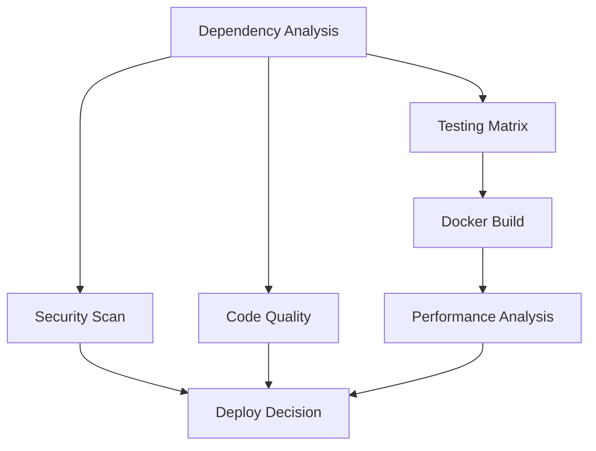
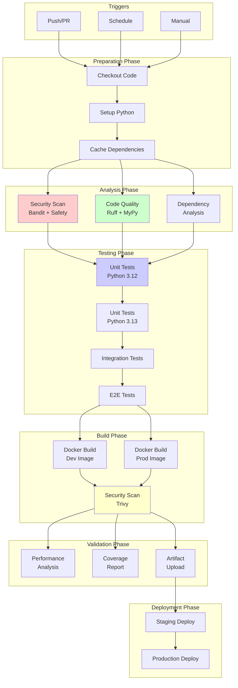

# Enhanced CI/CD Workflow Architecture Plan

## Overview

This document outlines the architectural design for an enhanced CI/CD workflow that builds upon the existing GitHub Actions setup. The enhanced workflow incorporates advanced features including dependency caching, security scanning, type checking, and performance optimizations while maintaining compatibility with the current FastAPI application structure.

## Current State Analysis

### Existing Workflow Structure
- **Triggers**: Push to `main`/`develop` branches, PR to `main`
- **Jobs**:
  - `test`: Matrix testing across Python 3.12/3.13 with PostgreSQL and Redis services
  - `docker`: Basic Docker image build and import test
- **Tools**: Ruff for linting, pytest for testing, Codecov for coverage

### Project Configuration
- **Python**: >=3.12 required
- **Framework**: FastAPI with SQLModel, asyncpg, Redis
- **Testing**: pytest with asyncio support
- **Linting**: Ruff with comprehensive rule set
- **Docker**: Multi-stage production build, simple development build

## Enhanced Workflow Architecture

### Core Principles
1. **Parallel Execution**: Maximize concurrency to reduce total build time
2. **Caching Strategy**: Cache dependencies, Docker layers, and build artifacts
3. **Security First**: Integrate security scanning at multiple stages
4. **Quality Gates**: Comprehensive linting, type checking, and testing
5. **Performance Monitoring**: Track and optimize build performance
6. **Modular Design**: Reusable jobs and composite actions

### Workflow Triggers and Conditions

```yaml
on:
  push:
    branches: [main, develop]
  pull_request:
    branches: [main]
  schedule:
    - cron: '0 2 * * 1'  # Weekly security scan on Mondays
  workflow_dispatch:
    inputs:
      environment:
        description: 'Target environment'
        required: true
        default: 'staging'
        type: choice
        options:
          - staging
          - production
```

### Job Architecture

#### 1. Dependency Analysis Job
**Purpose**: Analyze and cache Python dependencies
**Runner**: ubuntu-latest
**Key Features**:
- Poetry lock file validation
- Dependency vulnerability scanning
- License compliance checking

#### 2. Security Scanning Job
**Purpose**: Comprehensive security analysis
**Runner**: ubuntu-latest
**Tools**:
- Bandit for Python security issues
- Safety for dependency vulnerabilities
- Trivy for container scanning
- CodeQL for advanced security analysis

#### 3. Code Quality Job
**Purpose**: Static analysis and type checking
**Runner**: ubuntu-latest
**Tools**:
- Ruff (existing + enhanced configuration)
- MyPy for type checking
- Pre-commit hooks validation
- Import sorting and formatting

#### 4. Testing Matrix Job
**Purpose**: Comprehensive test execution
**Runner**: ubuntu-latest
**Matrix Strategy**:
```yaml
strategy:
  matrix:
    python-version: ["3.12", "3.13"]
    test-type: [unit, integration, e2e]
  fail-fast: false
```

**Features**:
- Parallel test execution
- Coverage reporting with thresholds
- Performance regression detection
- Test result artifacts

#### 5. Docker Build and Test Job
**Purpose**: Multi-stage Docker build with security scanning
**Runner**: ubuntu-latest
**Key Features**:
- BuildKit with caching
- Multi-stage build optimization
- Security scanning (Trivy)
- Performance testing
- Image vulnerability assessment

#### 6. Performance Analysis Job
**Purpose**: Performance benchmarking and monitoring
**Runner**: ubuntu-latest
**Features**:
- Build time tracking
- Test performance metrics
- Resource usage monitoring
- Performance regression alerts

### Caching Strategy

#### Python Dependencies
```yaml
- name: Cache pip dependencies
  uses: actions/cache@v4
  with:
    path: ~/.cache/pip
    key: ${{ runner.os }}-pip-${{ hashFiles('**/pyproject.toml') }}
    restore-keys: |
      ${{ runner.os }}-pip-
```

#### Docker Layers
```yaml
- name: Set up Docker Buildx
  uses: docker/setup-buildx-action@v3

- name: Cache Docker layers
  uses: actions/cache@v4
  with:
    path: /tmp/.buildx-cache
    key: ${{ runner.os }}-buildx-${{ github.sha }}
    restore-keys: |
      ${{ runner.os }}-buildx-
```

#### Additional Caches
- Ruff cache: `~/.cache/ruff`
- MyPy cache: `.mypy_cache`
- Pre-commit cache: `~/.cache/pre-commit`

### Security Enhancements

#### Bandit Integration
```yaml
- name: Security scan with bandit
  run: |
    pip install bandit
    bandit -r src/ -f json -o bandit-report.json
```

#### Container Security
- Trivy scanning for Docker images
- SBOM generation
- Vulnerability database updates

### Type Checking with MyPy

#### Configuration
```toml
[tool.mypy]
python_version = "3.12"
warn_return_any = true
warn_unused_configs = true
disallow_untyped_defs = true
disallow_incomplete_defs = true
check_untyped_defs = true
disallow_untyped_decorators = true
no_implicit_optional = true
warn_redundant_casts = true
warn_unused_ignores = true
warn_no_return = true
warn_unreachable = true
strict_equality = true
```

#### Integration
- Parallel execution with linting
- Incremental checking with caching
- Type coverage reporting

### Performance Optimizations

#### Parallel Job Execution


#### Complete Workflow Architecture


#### Build Time Optimizations
1. **Selective Testing**: Run full suite only on main branch
2. **Incremental Builds**: Use Git diff for targeted testing
3. **Artifact Reuse**: Share test results between jobs
4. **Resource Optimization**: Adjust runner size based on job requirements

#### Monitoring and Metrics
- Build duration tracking
- Cache hit rates monitoring
- Test execution time analysis
- Resource utilization metrics

### Enhanced Docker Testing

#### Multi-Stage Testing Strategy
1. **Unit Test Stage**: Test individual components
2. **Integration Test Stage**: Test service interactions
3. **Security Test Stage**: Scan for vulnerabilities
4. **Performance Test Stage**: Load testing and profiling

#### Docker Build Optimization
```dockerfile
# Build stage with caching
FROM python:3.12-slim as builder
RUN --mount=type=cache,target=/var/cache/apt \
    apt-get update && apt-get install -y gcc g++
```

### Workflow Dependencies and Conditions

#### Job Dependencies
```yaml
jobs:
  security:
    runs-on: ubuntu-latest
  quality:
    runs-on: ubuntu-latest
    needs: security
  test:
    runs-on: ubuntu-latest
    needs: [security, quality]
  docker:
    runs-on: ubuntu-latest
    needs: test
```

#### Conditional Execution
- Security scans: Always run
- Full test matrix: Main branch and PRs
- Docker build: Successful tests
- Performance analysis: Main branch only

### Artifact Management

#### Test Artifacts
- Coverage reports
- Test results (JUnit XML)
- Security scan reports
- Performance metrics

#### Build Artifacts
- Docker images (with tags)
- SBOM files
- Dependency manifests
- Build logs

### Error Handling and Notifications

#### Failure Handling
- Early failure detection
- Partial success handling
- Retry mechanisms for flaky tests
- Graceful degradation

#### Notifications
- Slack/Discord integration for failures
- Email notifications for security issues
- Dashboard integration for metrics

### Migration Strategy

#### Phase 1: Core Enhancements
1. Implement dependency caching
2. Add basic security scanning
3. Enhance Docker build process

#### Phase 2: Advanced Features
1. Add type checking
2. Implement performance monitoring
3. Add advanced security scanning

#### Phase 3: Optimization
1. Parallel job optimization
2. Cache strategy refinement
3. Performance bottleneck analysis

### Success Metrics

#### Performance Metrics
- Build time reduction: Target 40% improvement
- Cache hit rate: Target >80%
- Test execution time: Maintain <10 minutes

#### Quality Metrics
- Security vulnerability detection: 100% coverage
- Type checking coverage: >90%
- Test coverage: Maintain >85%

#### Reliability Metrics
- Build success rate: Target >95%
- False positive rate: <5%
- Mean time to detection: <5 minutes

## Implementation Considerations

### Tool Selection Rationale
- **Bandit**: Python-specific security scanning
- **MyPy**: Industry standard for Python type checking
- **Trivy**: Comprehensive container scanning
- **BuildKit**: Advanced Docker build capabilities

### Compatibility Requirements
- GitHub Actions limitations
- Runner resource constraints
- Third-party service integrations
- Cost optimization

### Maintenance Considerations
- Regular dependency updates
- Security signature updates
- Performance monitoring
- Documentation updates

## Next Steps and Implementation Roadmap

### Phase 1: Foundation (Week 1-2)
1. **Implement Dependency Caching**
   - Add pip cache configuration
   - Setup Docker layer caching with BuildKit
   - Configure Ruff and MyPy caching

2. **Basic Security Integration**
   - Add Bandit security scanning
   - Implement Safety for dependency vulnerabilities
   - Setup basic Trivy container scanning

3. **Enhanced Docker Builds**
   - Migrate to BuildKit
   - Implement multi-stage build optimization
   - Add build time caching

### Phase 2: Advanced Features (Week 3-4)
1. **Type Checking Integration**
   - Configure MyPy with strict settings
   - Add type coverage reporting
   - Integrate with existing Ruff workflow

2. **Performance Monitoring**
   - Add build time tracking
   - Implement cache hit rate monitoring
   - Setup performance regression detection

3. **Advanced Testing**
   - Implement parallel test execution
   - Add test performance metrics
   - Setup comprehensive coverage reporting

### Phase 3: Optimization and Monitoring (Week 5-6)
1. **Workflow Optimization**
   - Analyze and optimize job parallelism
   - Fine-tune caching strategies
   - Implement selective testing for PRs

2. **Monitoring and Alerting**
   - Setup dashboard integration
   - Configure failure notifications
   - Implement performance alerting

3. **Documentation and Training**
   - Update developer documentation
   - Create troubleshooting guides
   - Train team on new workflow features

### Success Criteria
- **Build Time**: Reduce average build time by 40%
- **Security**: Achieve 100% security scan coverage
- **Quality**: Maintain >85% test coverage with type checking
- **Reliability**: Achieve >95% build success rate

### Risk Mitigation
- **Gradual Rollout**: Implement changes incrementally with rollback plans
- **Testing**: Thoroughly test each phase before production deployment
- **Monitoring**: Continuous monitoring of build performance and reliability
- **Documentation**: Comprehensive documentation for troubleshooting

## Conclusion

This enhanced CI/CD architecture provides a robust, scalable, and secure foundation for the FastAPI application. The modular design allows for incremental implementation and continuous improvement while maintaining high standards for code quality, security, and performance.

The workflow balances comprehensive testing and security scanning with performance optimizations to ensure efficient development cycles without compromising quality gates.

**Ready for Implementation**: The detailed plan is complete and ready for review. Would you like me to proceed with implementing any specific phase, or would you prefer to modify any aspects of this design?